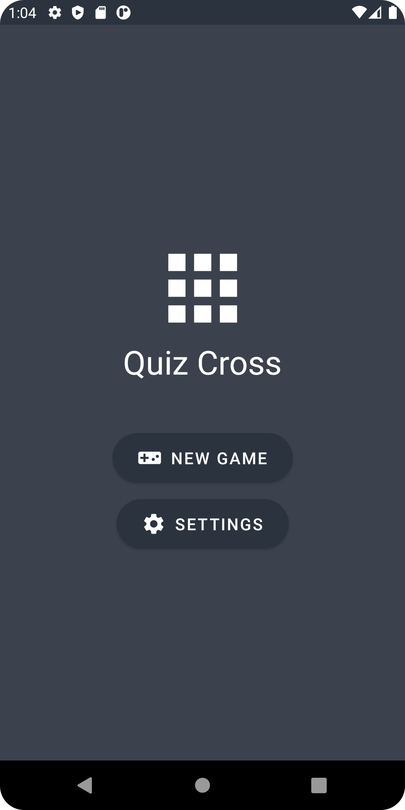
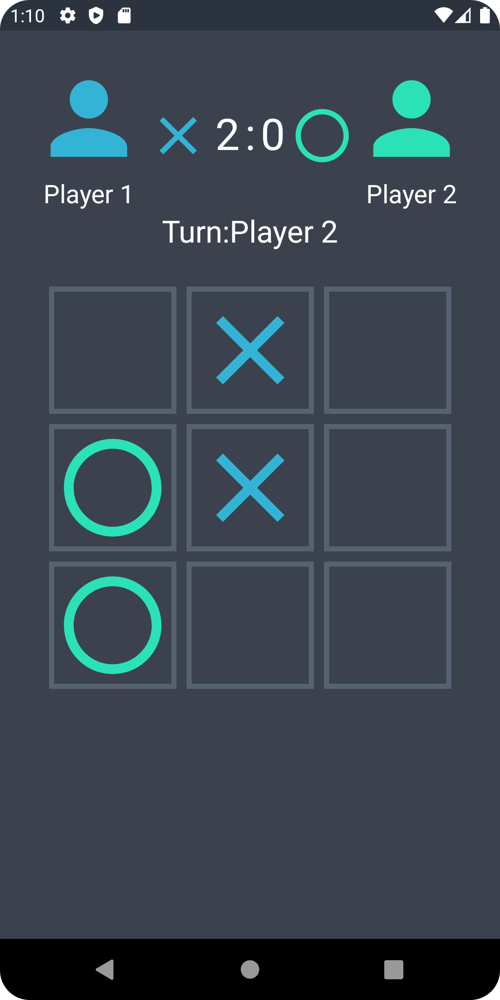

# Quiz-Cross
 O Quiz-Cross é um jogo para dispositivos Android que combina elementos de jogos da velha e perguntas e respostas. As perguntas são requisitadas de uma API externa. Este projeto foi desenvolvido em Kotlin e segue uma arquitetura MVVM.
 
 ## Tecnologias utilizadas
 - Kotlin
 - Android Jetpack (ViewModel, LiveData, Navigation, etc.)
 - Retrofit
 - Gson
 
 ## Funcionalidades

- Jogo de perguntas e respostas com uma combinação de jogo da velha.
- Perguntas são selecionadas aleatoriamente de uma lista.
- Pontuação é exibida no final do jogo.

## Capturas de Tela

   

## Arquitetura
O projeto segue a arquitetura MVVM (Model-View-ViewModel), que separa a lógica de negócio da interface do usuário. Ele é dividido em três camadas:

 - Model: responsável por acessar os dados do aplicativo (API externa neste caso) e fornecer os dados para a camada ViewModel.
 - View: responsável por exibir a interface do usuário e lidar com as interações do usuário. Ele se comunica com a camada ViewModel para atualizar a interface do usuário com os dados recebidos do Model.
 - ViewModel: responsável por gerenciar o estado da interface do usuário e processar as ações do usuário. Ele se comunica com a camada Model para buscar e atualizar os dados e se comunica com a camada View para atualizar a interface do usuário.

## API externa
O jogo usa uma API externa para fornecer perguntas e respostas. A API usada neste projeto é a [Open Trivia Database API](https://opentdb.com/). É possível escolher a categoria, o nível de dificuldade e o tipo de pergunta (múltipla escolha ou verdadeiro ou falso).

## Como jogar

1. Selecione um espaço no tabuleiro.
2. Responda a pergunta corretamente para marcar o espaço.
3. Jogue até que um jogador consiga três espaços em linha.

## Pré-requisitos

- Android Studio 4.0 ou superior.
- Android SDK 21 ou superior.
- Kotlin 1.4.21 ou superior.

## Como executar o projeto

1. Faça o clone deste repositório: `git clone https://github.com/AndreMP93/Quiz-Cross.git`
2. Abra o projeto no Android Studio.
3. Execute o aplicativo em um dispositivo Android ou em um emulador.

## Licença

Este projeto está licenciado sob a licença MIT - consulte o arquivo LICENSE.md para mais detalhes.
